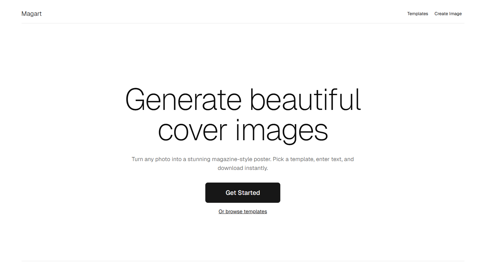

# 🎨 MagArt – Make Your Own Magazine Cover!

MagArt lets you turn your photos into beautiful, magazine-style posters in just a few clicks — no design skills required. No sign up required.

Try here: https://magart.vercel.app

---

## 🧩 What You Can Do

- ✅ Upload your own image  
- ✅ Choose from iconic magazine-style templates  
- ✅ Add your name or a custom title  
- ✅ Pick any text color  
- ✅ Instantly download your design as a PNG  
- ✅ See how many times templates have been downloaded

---

## 💡 How It Works

1. **Upload an Image**  
   Select any photo from your device — JPG, PNG, or WebP supported.

2. **Choose a Template**  
   Pick from a variety of stylish magazine layouts.

3. **Edit the Text**  
   Add your title or name. You can customize the text color too.

4. **Download the Image**  
   Click the Download button to save your magazine-style cover.

---

## 🖼️ Templates Inspired By

- **VOGUE**
- **Vanity Fair**
- **BUSINESS**
- **COSMOPOLITAN**
- **allure**
- **teenVOGUE**
- **MAN**
- **SATURDAY**

New templates are added regularly.

---

## 📱 Best Experience

> 💻 **Recommended on desktop/laptop** for the best editing experience.  
> 📱 Mobile is supported but limited when editing text.

---

## 🔐 Your Privacy

- Your uploaded images **never leave your browser**.
- Only download counts are tracked anonymously for fun stats.

---

## 💬 Feedback or Suggestions?

I'd love to hear from you! Want more templates? New features? Let me know.

---

Built with Next.js, shadcn/ui, and Tailwind CSS.
